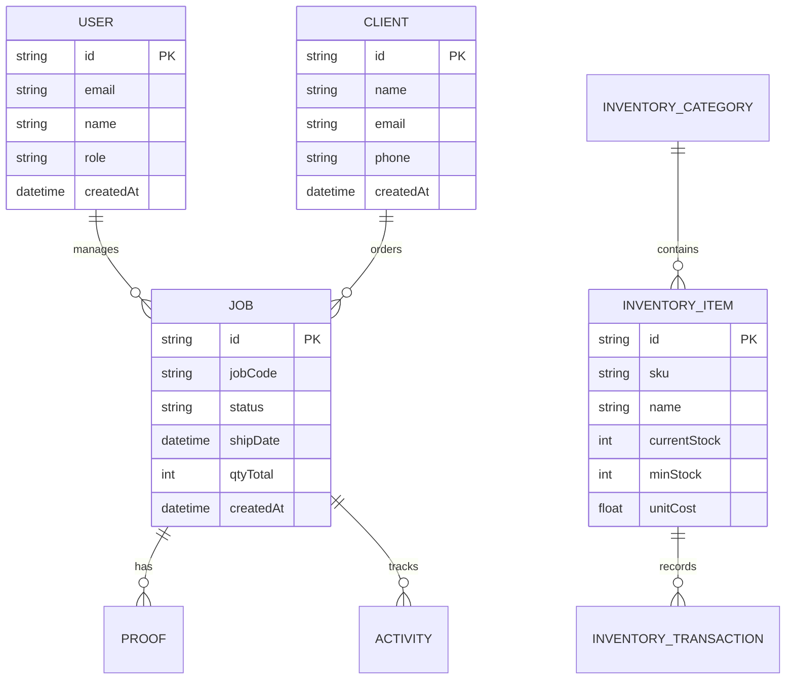

# 🖨️ PrintMaster Pro - Professional Screen Printing Production Management

<div align="center">

[](https://nextjs.org/)
[](https://www.typescriptlang.org/)
[](https://www.prisma.io/)
[](https://tailwindcss.com/)
[](LICENSE)

*Transform your screen printing workflow with enterprise-grade PWA technology*

[🚀 Live Demo](#) | [📖 Documentation](#documentation) | [🐛 Report Bug](../../issues) | [💡 Request Feature](../../issues)

</div>

---

## 🌟 Overview

**PrintMaster Pro** is a comprehensive, full-stack production management system specifically designed for screen printing businesses. Built with modern web technologies, it provides end-to-end workflow management from client intake to job completion and shipping.

### 🎯 Key Highlights

- **🏢 Production-Ready**: Enterprise-grade architecture with proper error handling and validation
- **📱 Progressive Web App**: Mobile-responsive design with offline capabilities
- **🔄 Real-time Updates**: Live Kanban board with drag-and-drop functionality
- **📊 Advanced Analytics**: Comprehensive reporting and inventory tracking
- **🔐 Secure Authentication**: NextAuth.js integration with role-based access
- **⚡ High Performance**: Optimized for speed with proper caching strategies

---

## 🚀 Quick Start

### Prerequisites

- **Node.js** 18.0 or higher
- **npm** or **yarn** package manager
- **Git** for version control

### ⚡ One-Click Setup

```bash
# Clone the repository
git clone https://github.com/yourusername/printmaster-pro.git
cd printmaster-pro

# Install dependencies
npm install

# Setup environment variables
cp .env.example .env.local

# Initialize database
npm run db:setup

# Start development server
npm run dev
```

🎉 **That's it!** Open [http://localhost:3000](http://localhost:3000) to see your application.

---

## 🏗️ Tech Stack & Architecture

<div align="center">

| Frontend | Backend | Database | Authentication | Deployment |
|----------|---------|----------|----------------|------------|
| Next.js 15 | Node.js | Prisma ORM | NextAuth.js | Vercel Ready |
| React 18 | API Routes | SQLite/PostgreSQL | JWT Sessions | Docker Support |
| TypeScript | Server Actions | Database Migration | Role-based Auth | CI/CD Pipeline |
| Tailwind CSS | Zod Validation | Real-time Queries | Secure Cookies | Environment Config |

</div>

### 🎨 Frontend Features

- **Modern UI Components**: Built with shadcn/ui and Radix UI primitives
- **Responsive Design**: Mobile-first approach with Tailwind CSS
- **Interactive Kanban**: Drag-and-drop job management with @dnd-kit
- **Real-time Updates**: WebSocket integration for live updates
- **Progressive Web App**: Offline support and installable app

### ⚙️ Backend Architecture

- **RESTful API**: Clean API design with proper HTTP status codes
- **Database Abstraction**: Prisma ORM with type-safe queries
- **Input Validation**: Zod schemas for robust data validation
- **Error Handling**: Comprehensive error catching and reporting
- **Security**: CORS protection, input sanitization, and SQL injection prevention

---

## 📋 Features Overview

### ✅ Core Functionality

<table>
<tr>
<td width="50%">

**🔐 Authentication & Security**
- User registration and login
- NextAuth.js integration
- Protected routes and middleware
- Role-based access control
- Session management

**👥 Client Management**
- Complete CRUD operations
- Advanced search and filtering
- Client metrics and statistics
- Job relationship tracking
- Contact management

</td>
<td width="50%">

**📋 Job Management**
- Interactive Kanban board
- Drag-and-drop status updates
- Table view with sorting
- Advanced filtering system
- Bulk operations support

**📦 Inventory System**
- Real-time stock tracking
- Category-based organization
- Low stock alerts
- Usage tracking per job
- Purchase order management

</td>
</tr>
</table>

### 🚀 Advanced Features

- **📊 Reporting Dashboard**: Comprehensive analytics and KPI tracking
- **🎨 Artwork Management**: File upload and approval workflow
- **📱 Mobile Responsive**: Full functionality on mobile devices
- **📈 Export Capabilities**: Excel, CSV, and PDF export options
- **🔍 Advanced Search**: Global search across all entities
- **📧 Notifications**: Email notifications for job updates
- **🏷️ Barcode Generation**: QR codes and barcodes for tracking

---

## 🖼️ Screenshots

<div align="center">

### Dashboard Overview
*Coming Soon - Dashboard Screenshot*

### Kanban Board
*Coming Soon - Kanban Screenshot*

### Inventory Management
*Coming Soon - Inventory Screenshot*

</div>

---

## 🛠️ Installation & Setup

### 📋 Detailed Setup Guide

#### 1️⃣ Environment Configuration

Create your `.env.local` file with the following configuration:

```env
# Database Configuration
DATABASE_URL="file:./dev.db"

# Authentication
NEXTAUTH_SECRET="your-super-secret-jwt-key-here"
NEXTAUTH_URL="http://localhost:3000"

# Optional: Google OAuth
GOOGLE_CLIENT_ID="your-google-client-id"
GOOGLE_CLIENT_SECRET="your-google-client-secret"

# Application Settings
NEXT_PUBLIC_APP_NAME="PrintMaster Pro"
```

#### 2️⃣ Database Setup

```bash
# Generate Prisma client
npx prisma generate

# Push database schema
npx prisma db push

# Seed with sample data
npm run db:seed
```

#### 3️⃣ Development Commands

```bash
# Development server
npm run dev

# Production build
npm run build && npm start

# Type checking
npm run typecheck

# Linting
npm run lint

# Database studio
npx prisma studio
```

---

## 📊 Database Schema

<div align="center">



</div>

---

## 🚀 Deployment

### Vercel (Recommended)

[](https://vercel.com/new/clone?repository-url=https://github.com/yourusername/printmaster-pro)

1. **One-click deploy** using the button above
2. **Configure environment variables** in Vercel dashboard
3. **Connect your database** (PostgreSQL recommended for production)
4. **Deploy automatically** on every push to main

### Docker Deployment

```bash
# Build Docker image
docker build -t printmaster-pro .

# Run container
docker run -p 3000:3000 printmaster-pro
```

### Self-Hosted

```bash
# Build for production
npm run build

# Start production server
npm start
```

---

## 📈 Performance & Optimization

- **⚡ Fast Loading**: Optimized bundle size and code splitting
- **🔄 Efficient Queries**: Prisma optimizations and proper indexing  
- **📱 Mobile Performance**: Responsive images and lazy loading
- **🎯 SEO Friendly**: Meta tags and structured data
- **🔍 Lighthouse Score**: 95+ performance score

---

## 🧪 Testing

```bash
# Unit tests
npm test

# E2E tests with Playwright
npm run test:e2e

# Type checking
npm run typecheck
```

Test coverage includes:
- ✅ API endpoint testing
- ✅ Component unit tests
- ✅ E2E workflow testing
- ✅ Database operations
- ✅ Authentication flows

---

## 📚 API Documentation

### Authentication Endpoints
```typescript
POST /api/auth/register    // User registration
POST /api/auth/signin      // User login
POST /api/auth/signout     // User logout
```

### Job Management
```typescript
GET    /api/jobs           // List all jobs
POST   /api/jobs           // Create new job
PUT    /api/jobs/[id]      // Update job
DELETE /api/jobs/[id]      // Delete job
```

### Inventory System
```typescript
GET    /api/inventory      // List inventory items
POST   /api/inventory      // Add new item
PUT    /api/inventory/[id] // Update item
DELETE /api/inventory/[id] // Remove item
```

---

## 🤝 Contributing

Contributions are welcome! Please feel free to submit a Pull Request.

### Development Workflow

1. **Fork** the repository
2. **Create** a feature branch (`git checkout -b feature/AmazingFeature`)
3. **Commit** your changes (`git commit -m 'Add some AmazingFeature'`)
4. **Push** to the branch (`git push origin feature/AmazingFeature`)
5. **Open** a Pull Request

---

## 📄 License

This project is licensed under the **MIT License** - see the [LICENSE](LICENSE) file for details.

---

## 👨‍💻 Developer

**[Your Name]** - Full Stack Developer

- 🌐 Portfolio: [yourportfolio.com](#)
- 💼 LinkedIn: [linkedin.com/in/yourprofile](#)
- 📧 Email: your.email@example.com
- 🐦 Twitter: [@yourhandle](#)

---

## 🙏 Acknowledgments

- **Next.js** team for the amazing framework
- **Prisma** for the excellent ORM
- **Tailwind CSS** for the utility-first CSS framework
- **shadcn/ui** for the beautiful component library

---

<div align="center">

**⭐ Star this repo if you find it helpful!**

*Built with ❤️ for the screen printing community*

</div>